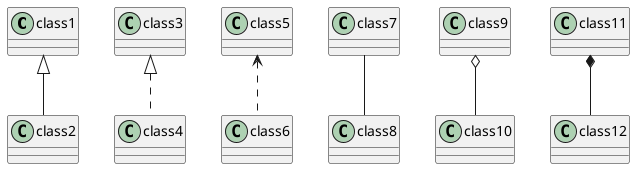
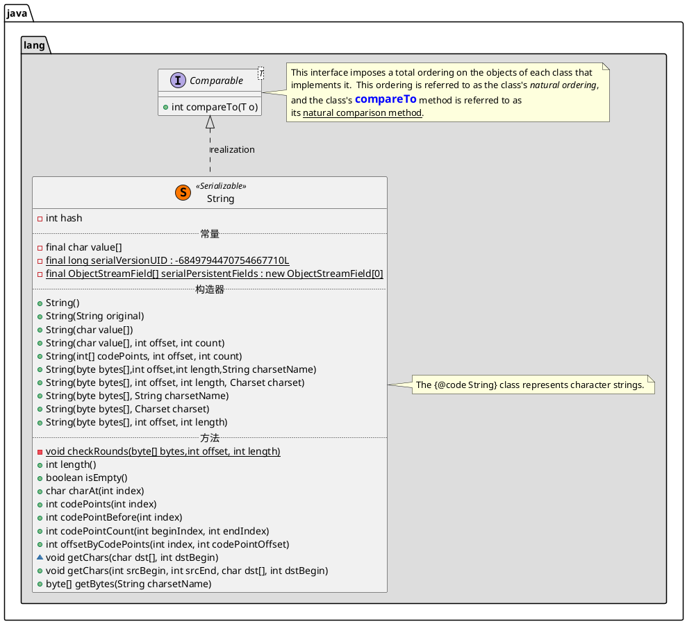

## UML基础介绍

> UML（Unified Modeling Language）统一建模语言，是一种用于软件系统分析和设计的语言工具，他用于帮助软件开发人员进行思考和记录思路的结果。

### UML图的分类

1. 用例图
2. 静态结构图：类图、对象图、包图、组件图、部署图
3. 动态行为图：交互图、状态图、活动图

## 安装PlantUML插件及Graphviz软件

- PlantUML插件
- [图像可视化的软件Graphviz]( https://graphviz.gitlab.io/_pages/Download/Download_windows.html )

1. 在IntelliJ IDEA中搜索并安装PlantUML，重启idea;
2. 下载安装graphviz，并配置环境变量 `GRAPHVIZ_DOT=D:\Program Files\Graphviz2.38\bin\dot.exe`

## 绘制类图

### 类之间的关系

- 依赖关系
  - 类中用到了对方
  - 类的成员属性
  - 方法的返回类型
  - 方法的参数类型
  - 方法中使用到
- 泛化关系
- 实现关系
- 关联关系（类与类之间的关系）
- 聚合关系（整体与部分，导航性，关联关系的特例，可分离）
- 组合关系（整体与部分，不可分离，共生共灭）

可以在符号中的`-`或者`.`间添加`up`、`down`、`left`、`right`来改变类关系连接线的方向

| Type                 | Symbol |
| -------------------- | ------ |
| Generalization(泛化) | <\|--  |
| Realization(实现)    | <\|..  |
| Dependency(依赖)     | <..    |
| Association(关联)    | --     |
| Aggregation(聚合)    | o--    |
| Composite(组合)      | *--    |

可以在关系语句后面通过`:`来添加类之间关系的说明

### 添加属性和方法

**类型**

| keyword        | Description |
| -------------- | ----------- |
| package        | 包          |
| abstract class | 抽象类      |
| interface      | 接口        |
| annotation     | 注解        |
| enum           | 枚举        |

**定义可访问性**

| Symbol | Visibility |
| ------ | ---------- |
| -      | private    |
| #      | protected  |
| ~      | default    |
| +      | public     |

**抽象与静态**

| Symbol     | Description |
| ---------- | ----------- |
| {static}   | 静态        |
| {abstract} | 抽象        |

**注释**

- 注释的位置

| Symbol         | Description |
| -------------- | ----------- |
| note left of   | 左边        |
| note right of  | 右边        |
| note top of    | 上边        |
| note bottom of | 下边        |

- 注释中的html标签

| Symbol                                              | Description |
| --------------------------------------------------- | ----------- |
| `<b>`                                               | 粗体        |
| `<u>`                                               | 下划线      |
| `<i>`                                               | 斜体        |
| `<s>`,`<del>`,`<strike>`                            | 删除        |
| ``,`` | 字体颜色    |
| `<size:nn>`                                         | 字体大小    |
| ``                                      | 图片        |

